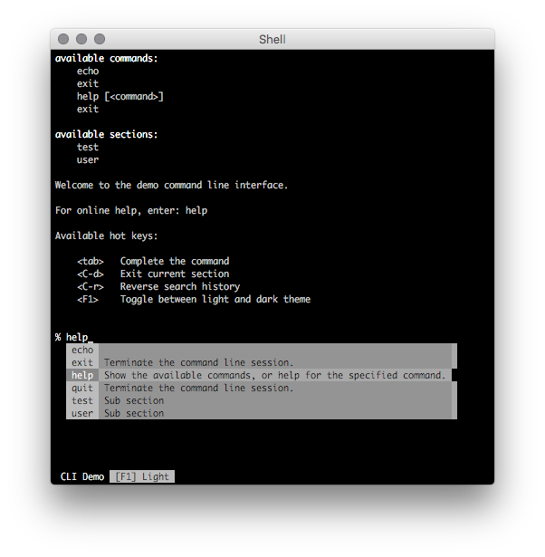
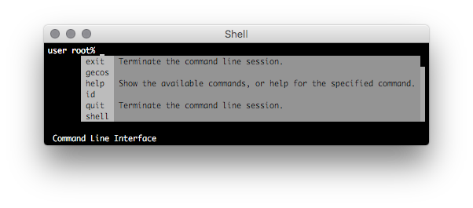
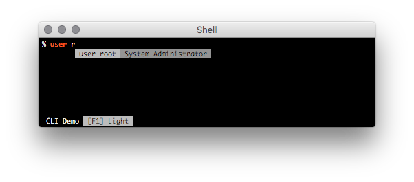
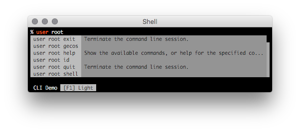

# Command Line Interface

Framework for creating beautiful command line interfaces.

This is version ``1.x``, it's not compatible with the older interface provided
by version ``0.x``.

## Features

  * Tab completion
  * History (with reverse search)
  * Syntax Highlighting

## Tab Completion

There is tab completion in most of the interface on commands and child sections:

It's also easy to do dynamic tab completion:

Also nested sections and commands are supported:

## TODO

  * Integrate different streams, so it also works over sockets
